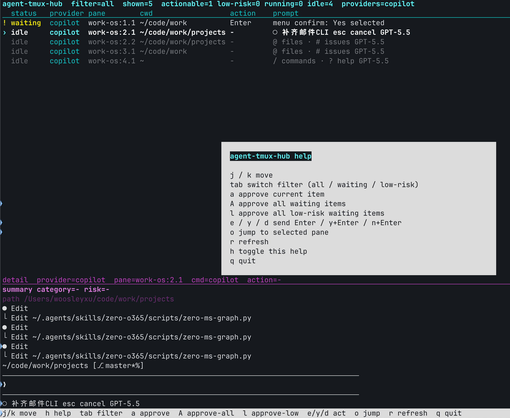

# agent-tmux-hub

[English](README.md)

`agent-tmux-hub` 是一个基于 tmux 的 agent 控制面板，用来集中查看和处理多个 agent CLI pane。

当你同时开着多个 Copilot、Claude Code 或 Codex pane 时，有些 pane 可能在等待确认，有些还在执行任务。这个工具把这些 pane 汇总到一个界面里，方便你查看状态、筛选等待项、跳转到目标 pane，并执行确认操作。



## 运行要求

- Python 3.11+
- tmux
- agent CLI 运行在 tmux pane 中

工具依赖 tmux 完成以下操作：

- 发现 pane
- 捕获 pane 最近输出
- 跳转到指定 pane
- 发送确认按键
- 在 tmux window 名称中显示等待项数量

## 项目结构

```text
agent-tmux-hub/
├── pyproject.toml
├── README.md
├── README.zh-CN.md
└── src/
    └── agent_tmux_hub/
        ├── __init__.py
        ├── app.py
        └── cli.py
```

## 安装

本地开发或个人使用时，建议用 editable 模式安装：

```bash
cd ~/code/agent-tmux-hub
python3 -m pip install -e .
```

如果 `agent-tmux-hub` 不在 `PATH` 中，可以安装到 user site，再从 user bin 目录启动：

```bash
python3 -m pip install --user -e .
~/.local/bin/agent-tmux-hub --window
```

## 功能

- 扫描 tmux 中的 agent CLI pane
- 当前识别：
  - GitHub Copilot CLI
  - Claude Code
  - Codex
- 识别常见的确认等待状态
- 将 pane 分类为 `waiting`、`running`、`idle`
- 在详情面板显示最近输出和上下文
- 提取轻量决策信息：
  - category
  - risk
  - target
- 支持批准当前项、全部等待项或低风险等待项
- 在 tmux window 名称中显示当前等待数量

## 使用

打开或聚焦专用 hub window：

```bash
agent-tmux-hub --window
```

在当前 tmux pane 中运行：

```bash
agent-tmux-hub --run
```

本地开发时也可以直接运行：

```bash
python src/agent_tmux_hub/cli.py
```

## 快捷键

| 按键 | 操作 |
| --- | --- |
| `j` / `k` | 向下 / 向上移动选择 |
| `h` | 显示或隐藏帮助层 |
| `tab` | 切换筛选：`all`、`waiting`、`low-risk` |
| `a` | 按检测到的动作批准当前项 |
| `A` | 批准所有等待项 |
| `l` | 批准所有低风险等待项 |
| `e` | 发送 `Enter` |
| `y` | 发送 `y` + `Enter` |
| `d` | 发送 `n` + `Enter` |
| `o` | 跳转到当前选中的 pane |
| `r` | 立即刷新 |
| `q` | 退出 |

## 详情面板

详情面板用于降低误批风险。批准某个 pane 前，可以先看到：

- provider
- pane 位置
- 当前命令
- 建议动作
- category / risk / target 摘要
- pane 最近真实输出

目标很简单：批准前先看清楚自己在批准什么。

## 通知

出现新的等待项时，工具会：

- 显示 tmux message
- 触发 tmux bell
- 在 hub window 名称后追加等待数量，例如：

```text
agent-tmux-hub[2]
```

## 已识别的确认模式

当前版本识别以下常见提示：

- `1. Yes / 2. No` 菜单确认
- `Press Enter`
- `Allow ...`
- `Continue?`
- `y/N`

如果工具无法确认应该执行什么动作，它不会编造动作。你仍然可以跳转到对应 pane 手动处理。

## 安全模型

这是一个辅助操作工具，不是全自动 autopilot。它的作用是集中注意力、减少来回切换，但仍然要求用户在批准重要操作前查看详情面板。
